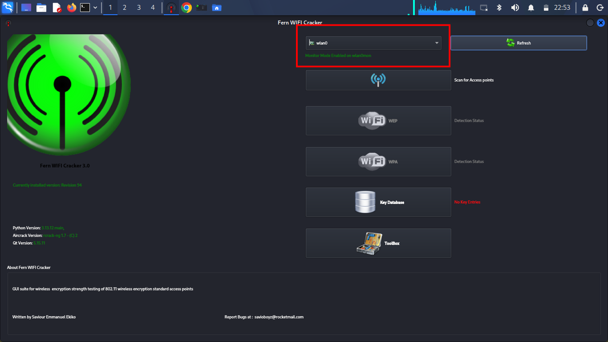
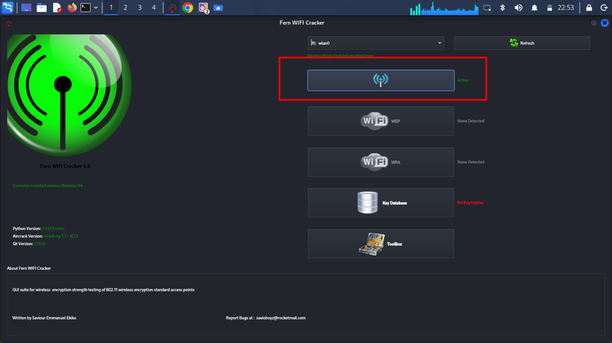
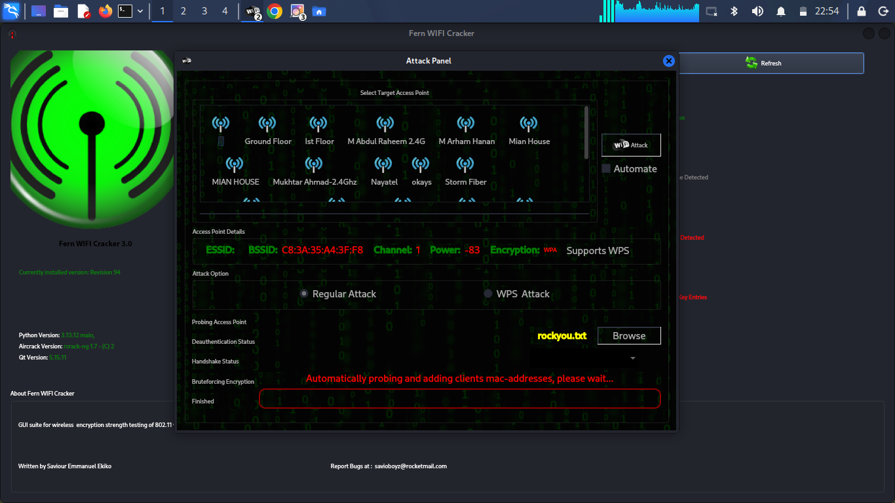
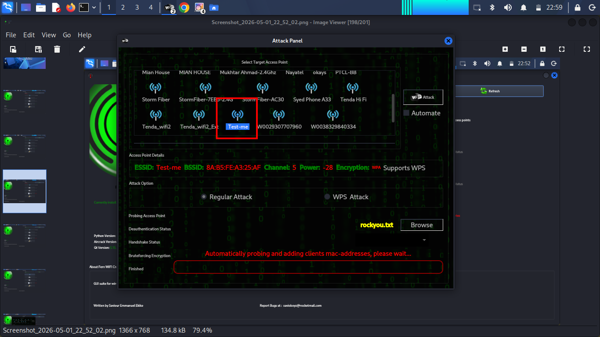
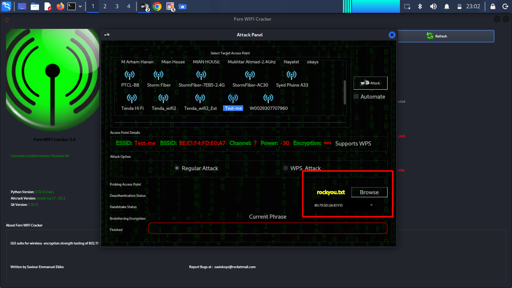
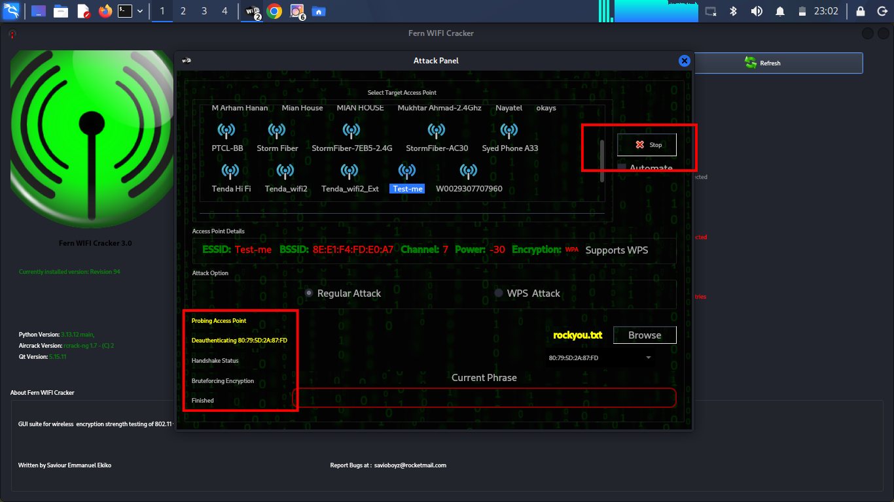
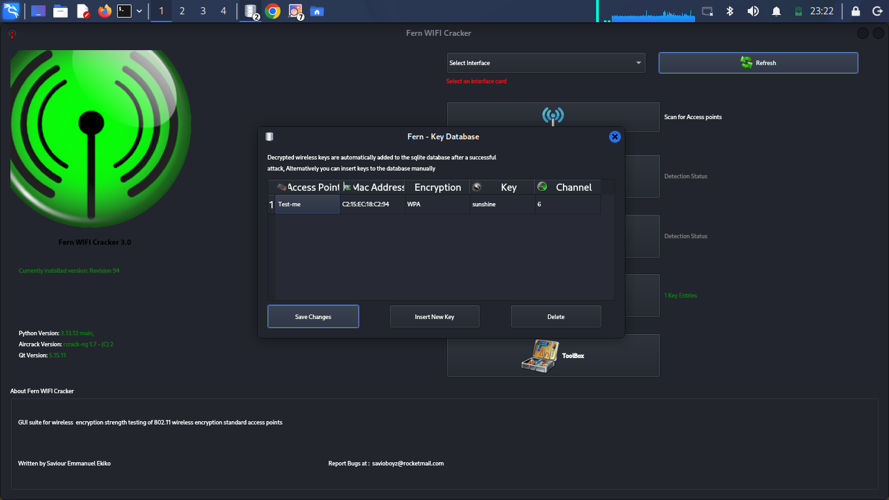

# 🔐 Fern Wifi Cracker Lab (Wireless Security Testing)


---

## 📌 Overview
**Fern WiFi Cracker** is a wireless security auditing tool used to test the strength of Wi-Fi networks. It identifies vulnerabilities in **WEP, WPA, and WPA2** by attempting password cracking using known techniques.

> ⚠️ **Disclaimer:**  
> This project was performed in a **controlled lab environment** for educational purposes only.  
> Do NOT attempt this on unauthorized networks.

---

## 🛠️ Requirements
- Linux OS 
- Fern WiFi Cracker (pre-installed)
- Wireless Adapter (supports Monitor Mode)
- Wordlist (e.g., `rockyou.txt`)

---

## 🚀 Lab Steps

### 🔹 Step 1: Launch Tool
- Open Applications
- Search: **Fern WiFi Cracker**
- Launch the tool  


---

### 🔹 Step 2: Select Interface
- Select interface: `wlan0`
- Enable Monitor Mode  


 
Verify using:
```bash
iwconfig
```

### 🔹 Step 3: Scan Networks
Click Scan for Access Points
Wait for results



### 🔹 Step 4: Select WPA Networks
Click on WPA Tab
View available networks



### 🔹 Step 5: Choose Target

Target Network:

SSID: Test-me
BSSID: 8A:B5:FE:A3:25:AF
Channel: 5
Power: -28
Encryption: WPA
WPS: Enabled



### 🔹 Step 6: Load Wordlist
Select wordlist (rockyou.txt)
Detect connected clients



### 🔹 Step 7: Perform Attack
Click WiFi Attack
🔍 Process:
Deauthenticate client
Capture 4-Way Handshake
Perform Brute Force Attack



###🔹 Step 8: Retrieve Password
Go to Key Database
View cracked password



🔎 Key Concepts
Concept	Description
Monitor Mode	Captures wireless packets
4-Way Handshake	WPA/WPA2 authentication
Deauthentication	Forces client reconnect
Brute Force	Tries multiple passwords
📊 Conclusion

This lab shows how weak Wi-Fi security can be exploited.

✅ Recommendations:
Use strong passwords
Disable WPS
Update router firmware
🛡️ Ethical Use

This project is strictly for:

Cybersecurity learning
Penetration testing practice
Lab environments

❌ Illegal usage is strictly prohibited.

👨‍💻 Author

Umer Saqib
Cyber Security Student
